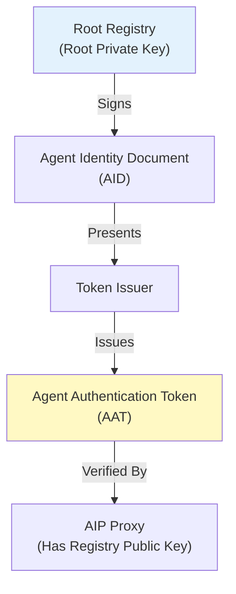
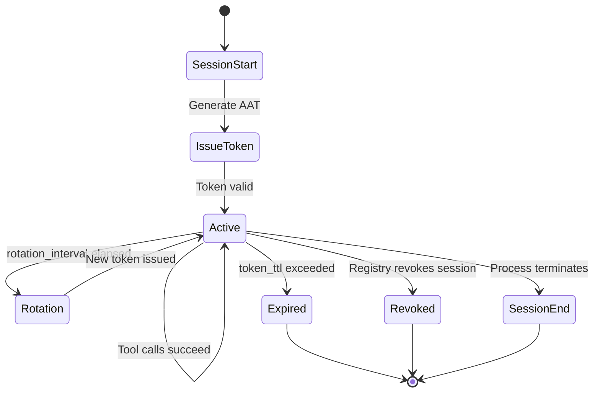

Layer 1 of AIP establishes **who the agent is** through cryptographic attestation. It provides the foundation for all authorization decisions in Layer 2. Without identity, enforcement is just allowlists. With identity, enforcement becomes **accountable, auditable, and revocable**.

<Note>
Layer 1 is currently **in progress** (as of AIP v1alpha2). The AAT structure and session semantics are defined, but the full Root Registry and federation infrastructure are under development.
</Note>

## The Problem: Agents Have No Identity

Today, when an AI agent makes a tool call, the infrastructure cannot answer:

- **Which specific agent** made this request?
- **Which human** is this agent acting on behalf of?
- **What policy** was this agent authorized under?
- **Is this a new session** or a continuation of an existing one?

API keys provide *application identity* but not *agent identity*. OAuth provides *user identity* but not *agent identity*. AIP fills this gap.

## Root of Trust

<Card title="Root Registry" icon="certificate">
The trust anchor for the AIP ecosystem. Acts as a Certificate Authority for agent identities.
</Card>

**Responsibilities**:
1. **Agent Registration**: Maintains canonical list of registered agents
2. **Certificate Signing**: Signs Agent Identity Documents (AID) with its private key
3. **Revocation Lists**: Publishes lists of revoked agent certificates
4. **Token Verification**: Provides public keys for AAT signature validation

**Security Model**:
- Registry holds a **root private key** (Ed25519 or ECDSA P-256)
- Private key must be protected (HSM recommended for production)
- Public key is distributed to all AIP proxies for signature verification



## Agent Identity Documents (AID)

An **Agent Identity Document** is a JSON structure that defines an agent's cryptographic identity. It's analogous to an X.509 certificate but designed specifically for AI agents.

### AID Structure

```json
{
  "agent_id": "github-agent-v1",
  "public_key": "-----BEGIN PUBLIC KEY-----\nMCowBQYDK2VwA2EAGb9ECWmEzf6FQbrBZ9w7lshQhqowtrbLDFw4rXAxZuE=\n-----END PUBLIC KEY-----",
  "key_algorithm": "ed25519",
  "capabilities": [
    "repos.get",
    "repos.list",
    "issues.create",
    "issues.list"
  ],
  "issued_at": "2026-03-03T10:00:00Z",
  "expires_at": "2027-03-03T10:00:00Z",
  "issuer": "aip-registry.example.com",
  "registry_signature": "<base64-encoded-signature>"
}
```

<AccordionGroup>
  <Accordion title="agent_id">
    Unique identifier for the agent. Must be globally unique within the registry.
    
    **Format**: DNS-like naming (e.g., `github-agent-v1`, `prod.customer-support.v2`)
    
    **Purpose**: Used in AATs, audit logs, and policy references
  </Accordion>
  
  <Accordion title="public_key">
    The agent's public key in PEM format.
    
    **Key Generation**: Agent generates its own key pair (private key never leaves the agent)
    
    **Supported Algorithms**:
    - `ed25519` (RECOMMENDED, 256-bit, fast)
    - `ecdsa-p256` (NIST P-256, widely supported)
    - `ecdsa-p384` (Higher security, slower)
  </Accordion>
  
  <Accordion title="capabilities">
    Optional list of capabilities the agent declares it will use.
    
    **Purpose**: Pre-declaration for auditing and least-privilege analysis
    
    **Note**: This is informational in v1alpha2. Layer 2 policy is authoritative.
  </Accordion>
  
  <Accordion title="registry_signature">
    Ed25519 signature over the canonical form of the AID (minus this field).
    
    **Verification**:
    ```
    VERIFY_AID(aid, registry_pubkey):
      canonical = CANONICALIZE(aid without signature field)
      RETURN ed25519_verify(registry_pubkey, canonical, aid.registry_signature)
    ```
  </Accordion>
</AccordionGroup>

### Agent Key Pairs

Each agent generates its own **private/public key pair**:

<Steps>
  <Step title="Key Generation (Agent-Side)">
    ```bash
    # Reference implementation (aip-go)
    aip-agent keygen --output agent-key.pem
    # Output: agent-key.pem (private), agent-key.pub (public)
    ```
    
    **Critical**: Private key NEVER leaves the agent's process/container.
  </Step>
  
  <Step title="Registration (Agent → Registry)">
    Agent submits public key + metadata to Registry:
    
    ```json
    {
      "agent_id": "github-agent-v1",
      "public_key": "<PEM-encoded-public-key>",
      "capabilities": ["repos.get", "issues.create"]
    }
    ```
  </Step>
  
  <Step title="Signing (Registry)">
    Registry validates the request and signs the AID:
    
    ```
    REGISTER_AGENT(request):
      aid = {
        agent_id: request.agent_id,
        public_key: request.public_key,
        ...
      }
      signature = sign(registry_private_key, CANONICALIZE(aid))
      aid.registry_signature = signature
      RETURN aid
    ```
  </Step>
  
  <Step title="Distribution (Registry → Agent)">
    Registry returns the signed AID to the agent. Agent stores it for token issuance.
  </Step>
</Steps>

### Revocation

The Registry maintains a **revocation list** of compromised or decommissioned agents:

```json
{
  "revoked_agents": [
    {
      "agent_id": "compromised-agent-v1",
      "revoked_at": "2026-03-03T12:00:00Z",
      "reason": "private_key_compromise"
    }
  ],
  "last_updated": "2026-03-03T12:00:00Z"
}
```

AIP proxies check this list on **every tool call** before accepting an AAT.

<Warning>
Revocation is enforced at **validation time**, not issuance time. This means a revoked agent's existing AATs are immediately invalid, even if they haven't expired.
</Warning>

## Agent Authentication Tokens (AAT)

An **Agent Authentication Token** is a short-lived, signed token that proves the agent's identity at runtime. It's the bridge between Layer 1 (identity) and Layer 2 (enforcement).

### AAT Structure (v1alpha2)

```json
{
  "version": "aip/v1alpha2",
  "aud": "https://mcp.example.com/api",
  "policy_hash": "a3c7f2e8d9b4f1e2c8a7d6f3e9b2c4f1a8e7d3c2b5f4e9a7c3d8f2b6e1a9c4f7",
  "session_id": "550e8400-e29b-41d4-a716-446655440000",
  "agent_id": "github-agent-v1",
  "issued_at": "2026-03-03T10:30:00Z",
  "expires_at": "2026-03-03T10:35:00Z",
  "nonce": "a1b2c3d4e5f6789012345678",
  "binding": {
    "process_id": 12345,
    "policy_path": "/etc/aip/policy.yaml",
    "hostname": "worker-node-1.example.com",
    "container_id": "abc123def456"
  }
}
```

<AccordionGroup>
  <Accordion title="version">
    Token format version. Must be `aip/v1alpha2` for this spec.
  </Accordion>
  
  <Accordion title="aud (Audience)">
    **NEW in v1alpha2**: The intended recipient of this token.
    
    **Purpose**: Prevents tokens issued for one MCP server from being accepted by another.
    
    **Configuration**:
    ```yaml
    identity:
      audience: "https://mcp.example.com/api"
    ```
    
    **Validation**: Proxy MUST reject tokens where `aud` doesn't match its configured audience.
  </Accordion>
  
  <Accordion title="policy_hash">
    SHA-256 hash of the canonical policy document.
    
    **Purpose**: Binds the token to a specific policy version. If the policy changes, tokens become invalid.
    
    **Computation**:
    ```
    POLICY_HASH(policy):
      # 1. Remove metadata.signature field
      # 2. Serialize to JSON using RFC 8785 (canonical JSON)
      # 3. SHA-256 hash
      canonical = JSON_CANONICALIZE(policy without signature)
      RETURN sha256(canonical).hex()
    ```
  </Accordion>
  
  <Accordion title="session_id">
    UUID v4 identifying the agent session.
    
    **Purpose**: Correlates all tool calls within a session for audit analysis.
    
    **Lifecycle**: Generated at session start, persists until session ends (process termination).
  </Accordion>
  
  <Accordion title="nonce">
    Random hex string (32+ bytes) for replay prevention.
    
    **Purpose**: Each token has a unique nonce. Proxies track used nonces to prevent replay attacks.
    
    **Storage**: Nonces are stored for `nonce_window` duration (default: same as `token_ttl`).
  </Accordion>
  
  <Accordion title="binding">
    **NEW in v1alpha2**: Context binding to prevent token theft.
    
    **Fields**:
    - `process_id`: OS process ID (always included)
    - `policy_path`: Absolute path to policy file (always included)
    - `hostname`: Normalized hostname (included for `session_binding: strict`)
    - `container_id`: Container ID if running in Docker/containerd (optional)
    - `pod_uid`: Kubernetes pod UID if running in k8s (optional)
    
    **Validation Modes**:
    ```yaml
    identity:
      session_binding: "process"  # Verify process_id only (default)
      session_binding: "policy"   # Verify policy_hash only
      session_binding: "strict"   # Verify all binding fields
    ```
  </Accordion>
</AccordionGroup>

### Token Encoding

AATs can be encoded in two formats:

<Tabs>
  <Tab title="JWT (Server Mode)">
    **When**: `server.enabled: true` (REQUIRED)
    
    **Format**: RFC 7519 JWT with custom `aip+jwt` type:
    
    ```
    Header:
    {
      "alg": "ES256",
      "typ": "aip+jwt"
    }
    
    Payload: (AAT structure above)
    
    Signature: ECDSA-SHA256(header + payload, issuer_private_key)
    ```
    
    **Token Example**:
    ```
    eyJhbGciOiJFUzI1NiIsInR5cCI6ImFpcCtqd3QifQ.eyJ2ZXJzaW9uIjoiYWlwL3YxYWxwaGEyIi...
    ```
    
    **Verification**: Standard JWT libraries can verify signatures using JWKS endpoint.
  </Tab>
  
  <Tab title="Compact (Local Mode)">
    **When**: `server.enabled: false` (local-only deployments)
    
    **Format**: Base64-encoded JSON + signature:
    
    ```
    base64url(json_payload) + "." + base64url(signature)
    ```
    
    **Use Case**: Simpler for local development, less overhead.
    
    **Limitation**: Not compatible with standard JWT tooling.
  </Tab>
</Tabs>

### Token Lifecycle



<Steps>
  <Step title="Session Start">
    When an AIP engine loads a policy with `identity.enabled: true`:
    
    ```yaml
    identity:
      enabled: true
      token_ttl: "5m"
      rotation_interval: "4m"
    ```
    
    - Generate `session_id` (UUID v4)
    - Compute `policy_hash`
    - Gather `binding` context (process ID, hostname, etc.)
  </Step>
  
  <Step title="Token Issuance">
    Issue the first AAT:
    
    ```
    ISSUE_TOKEN():
      nonce = RANDOM_HEX(32)
      token = {
        version: "aip/v1alpha2",
        aud: config.identity.audience,
        policy_hash: POLICY_HASH(current_policy),
        session_id: current_session_id,
        agent_id: current_policy.metadata.name,
        issued_at: NOW(),
        expires_at: NOW() + token_ttl,
        nonce: nonce,
        binding: current_binding
      }
      signature = SIGN(issuer_private_key, token)
      RETURN ENCODE_JWT(token, signature)
    ```
  </Step>
  
  <Step title="Token Rotation">
    Before expiry, rotate to a new token:
    
    ```
    ROTATION_LOOP():
      WHILE session_active:
        SLEEP(rotation_interval)
        new_token = ISSUE_TOKEN()
        current_token = new_token
    ```
    
    **Example Timeline**:
    ```
    T+0:  Issue token (expires at T+5m)
    T+4m: Rotate (new token, expires at T+9m)
    T+8m: Rotate (new token, expires at T+13m)
    ...
    ```
  </Step>
  
  <Step title="Token Validation">
    On every tool call, the proxy validates the AAT:
    
    ```
    VALIDATE_TOKEN(token):
      # 1. Check revocation FIRST
      IF token.session_id IN revoked_sessions:
        RETURN INVALID("session_revoked")
      
      # 2. Check expiration
      IF NOW() > token.expires_at:
        RETURN INVALID("token_expired")
      
      # 3. Check audience
      IF token.aud != expected_audience:
        RETURN INVALID("audience_mismatch")
      
      # 4. Check policy hash
      IF token.policy_hash != POLICY_HASH(current_policy):
        RETURN INVALID("policy_changed")
      
      # 5. Check session binding
      IF NOT VALIDATE_BINDING(token.binding, session_binding_mode):
        RETURN INVALID("binding_mismatch")
      
      # 6. Check nonce (atomic operation!)
      IF NOT ATOMIC_CHECK_AND_RECORD_NONCE(token.nonce):
        RETURN INVALID("replay_detected")
      
      RETURN VALID
    ```
  </Step>
</Steps>

## Session Management

### Session Binding Modes

<Tabs>
  <Tab title="process (Default)">
    **Binding**: Token tied to process ID
    
    **Configuration**:
    ```yaml
    identity:
      session_binding: "process"
    ```
    
    **Validation**:
    ```
    IF token.binding.process_id != current_process_id:
      REJECT
    ```
    
    **Use Case**: Single-instance agents (local development, single container)
    
    **Security**: Prevents token use in different process (stolen token scenario)
  </Tab>
  
  <Tab title="policy">
    **Binding**: Token tied to policy hash only
    
    **Configuration**:
    ```yaml
    identity:
      session_binding: "policy"
    ```
    
    **Validation**:
    ```
    IF token.policy_hash != POLICY_HASH(current_policy):
      REJECT
    ```
    
    **Use Case**: Multi-instance agents (Kubernetes horizontal scaling)
    
    **Trade-off**: More portable, but weaker binding (can be replayed across instances with same policy)
  </Tab>
  
  <Tab title="strict">
    **Binding**: Token tied to process, policy, AND hostname/container/pod
    
    **Configuration**:
    ```yaml
    identity:
      session_binding: "strict"
    ```
    
    **Validation**:
    ```
    IF token.binding.process_id != current_process_id:
      REJECT
    IF token.binding.hostname != current_hostname:
      REJECT
    IF token.binding.container_id != current_container_id:
      REJECT
    ```
    
    **Use Case**: High-security environments (production with static infrastructure)
    
    **Trade-off**: Strongest security, but tokens break on pod restart (ephemeral infrastructure)
  </Tab>
</Tabs>

<Warning>
**Kubernetes Warning**: Using `session_binding: "strict"` in Kubernetes causes tokens to become invalid on pod restart (pod UID changes). Use `"policy"` mode for k8s deployments.
</Warning>

### Nonce-Based Replay Prevention

Each AAT includes a unique **nonce** (random hex string). Proxies track used nonces to prevent replay attacks.

**Challenge**: In distributed deployments, nonces must be shared across instances.

**Solution**: Configurable nonce storage backends:

<Tabs>
  <Tab title="Memory (Default)">
    **Configuration**:
    ```yaml
    identity:
      nonce_storage:
        type: "memory"
    ```
    
    **Implementation**: `sync.Map` or similar in-memory structure
    
    **Use Case**: Single-instance deployments only
    
    **Limitation**: Cannot prevent cross-instance replay attacks
  </Tab>
  
  <Tab title="Redis (Production)">
    **Configuration**:
    ```yaml
    identity:
      nonce_storage:
        type: "redis"
        address: "redis://redis-cluster:6379"
        key_prefix: "prod:aip:nonce:"
        clock_skew_tolerance: "30s"
    ```
    
    **Implementation**: `SET NX` (atomic set-if-not-exists)
    
    **Use Case**: Multi-instance production deployments (RECOMMENDED)
    
    **TTL**: Nonces expire after `nonce_window` (default: same as `token_ttl`)
  </Tab>
  
  <Tab title="PostgreSQL">
    **Configuration**:
    ```yaml
    identity:
      nonce_storage:
        type: "postgres"
        address: "postgres://user:pass@db:5432/aip?sslmode=require"
    ```
    
    **Implementation**: Table with UNIQUE constraint on nonce
    
    **Use Case**: Environments with existing PostgreSQL infrastructure
  </Tab>
</Tabs>

**Atomic Nonce Check**:
```
ATOMIC_CHECK_AND_RECORD_NONCE(nonce, ttl):
  # Redis example
  result = REDIS_SET_NX(key="aip:nonce:" + nonce, value="used", ttl=ttl)
  RETURN result == OK  # OK if new, nil if already exists
```

## Revocation

### Revocation Targets

<Tabs>
  <Tab title="Token Revocation">
    **Scope**: Single token (by nonce)
    
    **Use Case**: Suspected token compromise
    
    **Mechanism**:
    ```json
    {
      "revoked_tokens": [
        {
          "nonce": "a1b2c3d4e5f6789012345678",
          "revoked_at": "2026-03-03T12:00:00Z",
          "reason": "token_theft_suspected"
        }
      ]
    }
    ```
    
    **Storage**: Retained for `nonce_window` duration (tokens naturally expire after that)
  </Tab>
  
  <Tab title="Session Revocation">
    **Scope**: All tokens in a session (by session_id)
    
    **Use Case**: User logout, session termination
    
    **Mechanism**:
    ```json
    {
      "revoked_sessions": [
        {
          "session_id": "550e8400-e29b-41d4-a716-446655440000",
          "revoked_at": "2026-03-03T12:00:00Z",
          "reason": "user_logout"
        }
      ]
    }
    ```
    
    **Storage**: Retained for `max_session_duration` (implementation-defined, default: 24h)
  </Tab>
  
  <Tab title="Agent Revocation">
    **Scope**: Entire agent identity (by agent_id)
    
    **Use Case**: Compromised private key, decommissioned agent
    
    **Mechanism**: Agent removed from Registry, AID signature becomes invalid
    
    **Effect**: All existing AATs for that agent become invalid immediately
  </Tab>
</Tabs>

### Revocation Check Flow

```
CHECK_REVOCATION(token):
  # 1. Check session revocation (fast, in-memory)
  IF token.session_id IN local_revoked_sessions:
    RETURN REVOKED("session_revoked")
  
  # 2. Check token revocation (fast, in-memory or Redis)
  IF token.nonce IN local_revoked_tokens:
    RETURN REVOKED("token_revoked")
  
  # 3. Check agent revocation (may require registry query)
  IF token.agent_id IN registry_revocation_list:
    RETURN REVOKED("agent_revoked")
  
  RETURN VALID
```

<Note>
Revocation checks happen **before** any other validation (expiry, policy hash, etc.). This ensures revoked credentials fail immediately.
</Note>

## Key Management (v1alpha2)

When `server.enabled: true`, AATs must be signed with a cryptographic key. AIP supports multiple key sources:

<Tabs>
  <Tab title="Auto-Generated (Default)">
    **Configuration**:
    ```yaml
    identity:
      keys:
        signing_algorithm: "ES256"
        key_source: "generate"
        rotation_period: "7d"
    ```
    
    **Behavior**:
    - Implementation generates key pair at startup
    - Private key stored in memory (or encrypted file)
    - Public key exposed via JWKS endpoint (`/v1/jwks`)
    - Keys rotate every `rotation_period`
  </Tab>
  
  <Tab title="File-Based">
    **Configuration**:
    ```yaml
    identity:
      keys:
        key_source: "file"
        key_path: "/etc/aip/signing-key.pem"
    ```
    
    **Use Case**: Controlled key distribution (load from Kubernetes Secret)
    
    **Rotation**: Manual (replace file and reload)
  </Tab>
  
  <Tab title="External KMS (Future)">
    **Configuration**:
    ```yaml
    identity:
      keys:
        key_source: "external"
        external:
          type: "vault"
          address: "https://vault.example.com"
          key_name: "aip-signing-key"
    ```
    
    **Use Case**: Integration with HashiCorp Vault, AWS KMS, etc.
    
    **Status**: Proposed for future versions
  </Tab>
</Tabs>

## Next Steps

<CardGroup cols={2}>
  <Card title="Layer 2: Enforcement" icon="shield-halved" href="/concepts/layer-2-enforcement">
    Learn how policy enforcement uses AATs to authorize tool calls
  </Card>
  <Card title="Architecture" icon="sitemap" href="/concepts/architecture">
    See how Layer 1 and Layer 2 work together
  </Card>
  <Card title="Threat Model" icon="triangle-exclamation" href="/concepts/threat-model">
    Understand how identity prevents impersonation and hijacking
  </Card>
  <Card title="Policy Reference" icon="book" href="/reference/policy-yaml">
    Write policies that require AAT validation
  </Card>
</CardGroup>