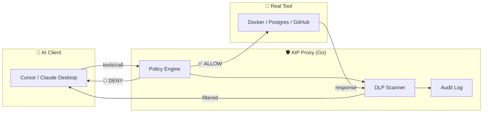
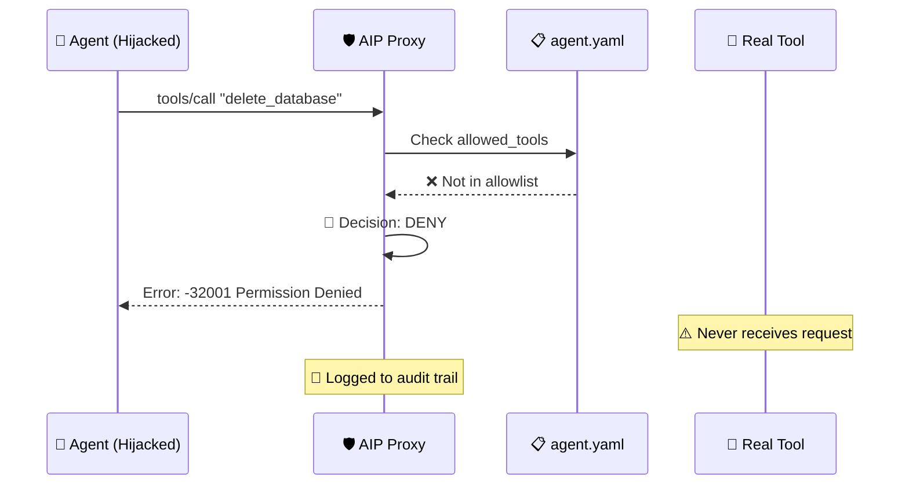

## Overview

The **Go implementation** is the reference implementation of the Agent Identity Protocol. It provides a production-ready proxy that enforces zero-trust authorization for AI agents.

<Card
  title="aip-go Repository"
  icon="github"
  href="https://github.com/openagentidentityprotocol/aip-go"
>
  Official Go SDK and proxy implementation - stable and production-ready
</Card>

## Implementation Status

| Language | Repository | Status | Conformance Level |
|----------|------------|--------|------------------|
| **Go** | [aip-go](https://github.com/openagentidentityprotocol/aip-go) | ✅ Stable | Full + Extended |
| **Rust** | [aip-rust](https://github.com/openagentidentityprotocol/aip-rust) | 🚧 Coming Soon | - |

## What the Go Proxy Does

The Go proxy operates as a **transparent sidecar** between your AI client (Cursor, Claude Desktop, VS Code) and MCP tool servers. It intercepts every tool call and enforces policy before the request reaches your infrastructure.



### Core Capabilities

<CardGroup cols={2}>
  <Card title="Policy Enforcement" icon="shield-check">
    Tool allowlists, argument validation, and action-level authorization
  </Card>
  <Card title="DLP Scanning" icon="eye-slash">
    Redacts secrets (API keys, credentials) from agent responses
  </Card>
  <Card title="Audit Logging" icon="file-lines">
    Immutable JSONL logs tied to agent identity for compliance
  </Card>
  <Card title="Human-in-the-Loop" icon="hand-paper">
    Native OS approval dialogs for sensitive operations
  </Card>
</CardGroup>

## Installation

<Steps>
  <Step title="Install the Go proxy">
    ```bash
    # Using Go
    go install github.com/openagentidentityprotocol/aip-go/cmd/aip@latest

    # Or download binary from releases
    curl -L https://github.com/openagentidentityprotocol/aip-go/releases/latest/download/aip-linux-amd64 -o aip
    chmod +x aip
    ```
  </Step>

  <Step title="Verify installation">
    ```bash
    aip --version
    ```
  </Step>
</Steps>

## Quick Start

<Steps>
  <Step title="Wrap an existing MCP server">
    ```bash
    # Secure your Docker MCP with a read-only policy
    aip wrap docker --policy ./policies/read-only.yaml
    ```
  </Step>

  <Step title="Start the proxy manually">
    ```bash
    # Proxy any MCP server
    aip --target "python mcp_server.py" --policy ./agent.yaml
    ```
  </Step>

  <Step title="Generate IDE configuration">
    ```bash
    # Generate Cursor/Claude Desktop config
    aip --generate-cursor-config --policy ./agent.yaml --target "npx @mcp/server"
    ```
  </Step>
</Steps>

## Basic Usage Example

### Define Your Policy

```yaml agent.yaml
apiVersion: aip.io/v1alpha1
kind: AgentPolicy
metadata:
  name: secure-agent
spec:
  mode: enforce
  allowed_tools:
    - read_file
    - list_directory
    - git_status
  tool_rules:
    - tool: write_file
      action: ask        # Human approval required
    - tool: exec_command
      action: block      # Never allowed
  dlp:
    patterns:
      - name: "AWS Key"
        regex: "AKIA[A-Z0-9]{16}"
      - name: "GitHub Token"
        regex: "ghp_[a-zA-Z0-9]{36}"
```

### Run the Proxy

```bash
aip --target "npx -y @modelcontextprotocol/server-filesystem /home/user" \
    --policy ./agent.yaml \
    --audit-log ./audit.jsonl
```

### What Happens on a Policy Violation

When an agent attempts a blocked action:

```json
{
  "jsonrpc": "2.0",
  "id": 1,
  "error": {
    "code": -32001,
    "message": "Permission Denied: Tool 'delete_database' is not allowed by policy"
  }
}
```

**The request never reaches your infrastructure.** This is zero-trust authorization in action.

## Architecture Features

### Defense-in-Depth

The Go proxy implements multiple security layers:

<Steps>
  <Step title="Signature Verification">
    Verifies Agent Authentication Token (AAT) cryptographic signatures
  </Step>
  <Step title="Policy Evaluation">
    Checks tool calls against YAML-defined authorization rules
  </Step>
  <Step title="Argument Validation">
    Validates tool arguments using regex patterns and type constraints
  </Step>
  <Step title="DLP Scanning">
    Scans both requests and responses for sensitive data patterns
  </Step>
  <Step title="Audit Logging">
    Writes immutable logs for every decision (allow, deny, ask)
  </Step>
</Steps>

### Attack Blocked Example



## Reference Implementation Features

The Go proxy is the **canonical implementation** of the AIP specification and demonstrates:

<CardGroup cols={2}>
  <Card title="Policy Loading" icon="file-code">
    YAML and JSON schema validation
  </Card>
  <Card title="Unicode Normalization" icon="language">
    NFKC normalization for security
  </Card>
  <Card title="Error Codes" icon="triangle-exclamation">
    All AIP-defined error codes (-32001, -32002, etc.)
  </Card>
  <Card title="Monitor Mode" icon="eye">
    Non-blocking policy testing
  </Card>
</CardGroup>

<Note>
  **Conformance Level:** The Go implementation passes **Full + Extended** conformance tests. See [Conformance Testing](/reference/conformance-testing) for details.
</Note>

## Configuration Options

### Command-Line Flags

| Flag | Description | Example |
|------|-------------|----------|
| `--target` | Command to launch the real MCP server | `"python server.py"` |
| `--policy` | Path to policy YAML file | `./agent.yaml` |
| `--audit-log` | Path to audit log file (JSONL) | `./audit.jsonl` |
| `--mode` | Override policy mode (`enforce`/`monitor`) | `monitor` |
| `--port` | Port for proxy to listen on | `3000` |

### Environment Variables

```bash
# Override policy mode
export AIP_MODE=monitor

# Set custom audit log location
export AIP_AUDIT_LOG=/var/log/aip/audit.jsonl

# Enable debug logging
export AIP_LOG_LEVEL=debug
```

## Development

### Prerequisites

- Go 1.21+
- MCP-compatible tool server

### Build from Source

```bash
# Clone the repository
git clone https://github.com/openagentidentityprotocol/aip-go.git
cd aip-go

# Build the proxy
go build ./cmd/aip

# Run tests
go test -race -cover ./...
```

### Code Style

```bash
# Format code
gofmt -s -w .

# Lint
go vet ./...
golangci-lint run
```

## Next Steps

<CardGroup cols={2}>
  <Card title="Conformance Testing" icon="clipboard-check" href="/reference/conformance-testing">
    Validate your AIP implementation
  </Card>
  <Card title="Policy Reference" icon="book" href="/reference/policy-yaml">
    Complete YAML schema documentation
  </Card>
  <Card title="Contributing" icon="code-pull-request" href="/guides/installation">
    Build new language implementations
  </Card>
  <Card title="Specification" icon="file-lines" href="/reference/spec-v1alpha2">
    Read the formal protocol definition
  </Card>
</CardGroup>

## Community

Want to contribute to the Go implementation?

- **GitHub Issues:** Bug reports and feature requests
- **Pull Requests:** Code contributions welcome
- **Discussions:** Architecture and design questions

See [CONTRIBUTING.md](https://github.com/ArangoGutierrez/agent-identity-protocol/blob/main/CONTRIBUTING.md) for guidelines.
