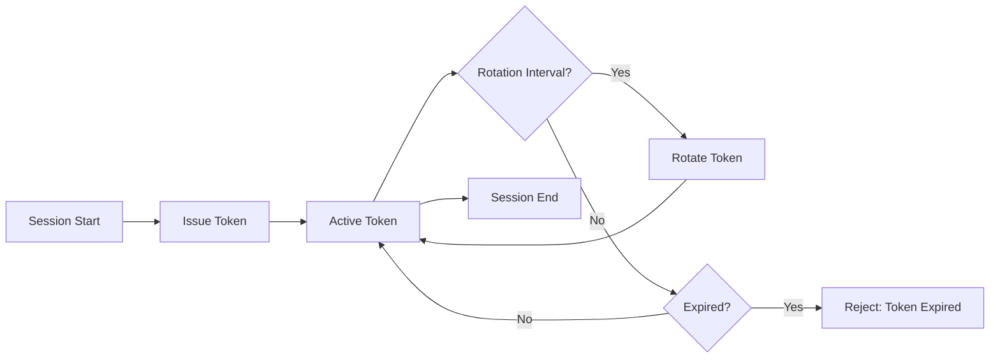

AIP Identity Tokens (also called Agent Authentication Tokens) provide cryptographic proof of agent identity and session binding. This page documents the token structure, lifecycle, and validation process.

<Info>
  Identity tokens are a **v1alpha2 feature**. Enable with `spec.identity.enabled: true` in your policy.
</Info>

---

## Token Structure

AIP Identity Tokens are JWT-like structures with the following fields:

```json
{
  "version": "aip/v1alpha2",
  "aud": "<audience-uri>",
  "policy_hash": "<64-char-hex>",
  "session_id": "<uuid>",
  "agent_id": "<policy-name>",
  "issued_at": "<ISO-8601>",
  "expires_at": "<ISO-8601>",
  "nonce": "<random-hex>",
  "binding": {
    "process_id": <int>,
    "policy_path": "<string>",
    "hostname": "<string>"
  }
}
```

### Token Claims

<ResponseField name="version" type="string" required>
  Token format version. **Must be** `"aip/v1alpha2"`.
</ResponseField>

<ResponseField name="aud" type="string" required>
  Intended audience (from `identity.audience` or `metadata.name`).
  
  **Purpose**: Prevents tokens issued for one MCP server from being accepted by another.
  
  **Example**: `"https://mcp.example.com/api"`
</ResponseField>

<ResponseField name="policy_hash" type="string" required>
  SHA-256 hash of the canonical policy document.
  
  **Format**: 64-character lowercase hex string
  
  **Purpose**: Ensures token is bound to a specific policy version.
  
  **Example**: `"a3c7f2e8d9b4f1e2c8a7d6f3e9b2c4f1a8e7d3c2b5f4e9a7c3d8f2b6e1a9c4f7"`
</ResponseField>

<ResponseField name="session_id" type="string" required>
  UUID identifying this agent session.
  
  **Format**: UUID v4
  
  **Purpose**: Links related audit events and enables session revocation.
  
  **Example**: `"550e8400-e29b-41d4-a716-446655440000"`
</ResponseField>

<ResponseField name="agent_id" type="string" required>
  Value of `metadata.name` from the policy.
  
  **Example**: `"production-agent"`
</ResponseField>

<ResponseField name="issued_at" type="string" required>
  Token issuance time.
  
  **Format**: ISO 8601 with milliseconds (UTC)
  
  **Example**: `"2026-01-24T10:30:00.000Z"`
</ResponseField>

<ResponseField name="expires_at" type="string" required>
  Token expiration time.
  
  **Format**: ISO 8601 with milliseconds (UTC)
  
  **Constraint**: `expires_at = issued_at + token_ttl`
  
  **Example**: `"2026-01-24T10:35:00.000Z"` (5 minutes after issuance)
</ResponseField>

<ResponseField name="nonce" type="string" required>
  Random value for replay prevention.
  
  **Format**: Hexadecimal string (32+ characters recommended)
  
  **Purpose**: Prevents token reuse. Nonces are tracked and rejected if seen twice.
  
  **Example**: `"a1b2c3d4e5f6789012345678abcdef01"`
</ResponseField>

<ResponseField name="binding" type="object" required>
  Session binding context (see [Binding Object](#binding-object)).
</ResponseField>

---

## Binding Object

The `binding` object ties tokens to their execution context, preventing token theft across processes/hosts.

```json
{
  "binding": {
    "process_id": 12345,
    "policy_path": "/etc/aip/policy.yaml",
    "hostname": "worker-node-1.example.com",
    "container_id": "abc123def456",
    "pod_uid": "550e8400-e29b-41d4-a716-446655440000"
  }
}
```

<ResponseField name="binding.process_id" type="integer" required>
  OS process ID of the AIP engine.
  
  **Checked when**: `session_binding: "process"` or `"strict"`
</ResponseField>

<ResponseField name="binding.policy_path" type="string" required>
  Absolute path to the policy file.
  
  **Example**: `"/etc/aip/agent-policy.yaml"`
</ResponseField>

<ResponseField name="binding.hostname" type="string" required>
  Normalized hostname (see [Hostname Normalization](#hostname-normalization)).
  
  **Checked when**: `session_binding: "strict"`
  
  **Example**: `"k8s:550e8400-e29b-41d4-a716-446655440000"` (Kubernetes pod UID)
</ResponseField>

<ResponseField name="binding.container_id" type="string">
  Docker/containerd container ID (first 12 characters).
  
  **Present when**: Running in a container
</ResponseField>

<ResponseField name="binding.pod_uid" type="string">
  Kubernetes pod UID.
  
  **Present when**: Running in Kubernetes
</ResponseField>

### Hostname Normalization

Hostnames are normalized for consistent binding across environments:

| Environment | Hostname Value | Example |
|-------------|----------------|----------|
| Kubernetes | `k8s:<pod-uid>` | `k8s:550e8400-e29b-41d4-a716-446655440000` |
| Docker | `container:<id>` | `container:abc123def456` |
| Bare metal/VM | FQDN | `worker-1.example.com` |
| Serverless | `lambda:<request-id>` | `lambda:req-abc123` |

**Priority order** (use first available):
1. `POD_UID` environment variable (Kubernetes)
2. Container ID from `/proc/1/cpuset` or cgroup
3. FQDN (if hostname contains `.`)
4. Short hostname + domain from `/etc/resolv.conf`
5. Short hostname

---

## Token Encoding

Tokens are encoded as **RFC 7519 JWTs** when `server.enabled: true` (REQUIRED for server mode).

### JWT Header

```json
{
  "alg": "ES256",
  "typ": "aip+jwt",
  "kid": "key-2026-01-24"
}
```

<ResponseField name="alg" type="string" required>
  Signing algorithm.
  
  **Supported algorithms** (in order of preference):
  - `ES256` (ECDSA P-256 + SHA-256) - **RECOMMENDED for production**
  - `EdDSA` (Ed25519) - RECOMMENDED for performance
  - `ES384` (ECDSA P-384 + SHA-384) - High-security environments
  - `RS256` (RSA 2048+ + SHA-256) - Legacy compatibility
  - `HS256` (HMAC-SHA256) - **Local-only, NOT for server mode**
</ResponseField>

<ResponseField name="typ" type="string" required>
  Token type. **Must be** `"aip+jwt"`.
</ResponseField>

<ResponseField name="kid" type="string" required>
  Key ID for signature verification.
  
  **Purpose**: Allows key rotation. Clients fetch public keys from JWKS endpoint.
</ResponseField>

### JWT Payload

The payload contains the token claims documented above.

### JWT Signature

Tokens are signed using the algorithm specified in the header. Implementations MUST verify:
1. Signature is valid for the token header + payload
2. Signing key matches the `kid` in JWKS
3. Algorithm matches policy configuration

**Example JWT** (formatted for readability):
```
eyJhbGciOiJFUzI1NiIsInR5cCI6ImFpcCtqd3QiLCJraWQiOiJrZXktMjAyNi0wMS0yNCJ9.
eyJ2ZXJzaW9uIjoiYWlwL3YxYWxwaGEyIiwiYXVkIjoiaHR0cHM6Ly9tY3AuZXhhbXBsZS5jb20iLCJwb2xpY3lfaGFzaCI6ImEzYzdmMmU4ZDliNGYxZTJjOGE3ZDZmM2U5YjJjNGYxYThlN2QzYzJiNWY0ZTlhN2MzZDhmMmI2ZTFhOWM0ZjciLCJzZXNzaW9uX2lkIjoiNTUwZTg0MDAtZTI5Yi00MWQ0LWE3MTYtNDQ2NjU1NDQwMDAwIiwiYWdlbnRfaWQiOiJwcm9kdWN0aW9uLWFnZW50IiwiaXNzdWVkX2F0IjoiMjAyNi0wMS0yNFQxMDozMDowMC4wMDBaIiwiZXhwaXJlc19hdCI6IjIwMjYtMDEtMjRUMTA6MzU6MDAuMDAwWiIsIm5vbmNlIjoiYTFiMmMzZDRlNWY2Nzg5MDEyMzQ1Njc4YWJjZGVmMDEiLCJiaW5kaW5nIjp7InByb2Nlc3NfaWQiOjEyMzQ1LCJwb2xpY3lfcGF0aCI6Ii9ldGMvYWlwL3BvbGljeS55YW1sIiwiaG9zdG5hbWUiOiJ3b3JrZXItMS5leGFtcGxlLmNvbSJ9fQ.
MEUCIQDXYZ1234abcd...
```

---

## Token Lifecycle



### 1. Token Issuance

Tokens are issued when:
- Session starts (first tool call with `identity.enabled: true`)
- Rotation interval elapsed
- Policy changes (new `policy_hash`)

**Issuance process**:
1. Generate random nonce (32+ bytes)
2. Compute policy hash from canonical policy
3. Set `expires_at = now() + token_ttl`
4. Sign token with current signing key
5. Log `TOKEN_ISSUED` event to audit log

### 2. Token Rotation

Rotation creates a new token while the old token is still valid (grace period).

**Rotation process**:
1. Check if `now() > issued_at + rotation_interval`
2. Generate new nonce
3. Issue new token with same `session_id`
4. Log `TOKEN_ROTATED` event
5. Old token remains valid until `expires_at`

**Example timeline**:
```
Time 0:00  Issue token A (expires 5:00)
Time 4:00  Rotate to token B (expires 9:00)
Time 5:00  Token A expires
Time 8:00  Rotate to token C (expires 13:00)
```

### 3. Token Validation

Every request with a token undergoes validation:

**Validation steps**:
1. **Check revocation** (session or nonce in revocation list)
2. **Check expiration** (`now() <= expires_at`)
3. **Check audience** (`aud` matches `identity.audience`)
4. **Check policy hash** (`policy_hash` matches current policy or in grace period)
5. **Check session binding** (based on `session_binding` mode)
6. **Check nonce** (not seen before, atomic check-and-record)
7. **Verify signature** (JWT signature valid for payload)

**Validation failure**: Returns error code `-32009` (Token Invalid) with specific `token_error` value.

### 4. Token Revocation

Tokens can be revoked before expiration:

**Revocation types**:
- **Session revocation**: Invalidate all tokens for a `session_id`
- **Token revocation**: Invalidate specific token by `nonce`

**Revocation endpoint**:
```http
POST /v1/revoke HTTP/1.1
Authorization: Bearer <admin-token>
Content-Type: application/json

{
  "type": "session",
  "session_id": "550e8400-e29b-41d4-a716-446655440000",
  "reason": "Suspected compromise"
}
```

**Response**:
```json
{
  "revoked": true,
  "type": "session",
  "target": "550e8400-e29b-41d4-a716-446655440000",
  "revoked_at": "2026-01-24T10:30:00.000Z"
}
```

---

## Session Binding Modes

The `session_binding` policy field controls how strictly tokens are bound to execution context.

<ParamField path="session_binding" type="string" default="process">
  
  | Mode | Checks | Use Case |
  |------|--------|----------|
  | `process` | Process ID | Single-machine, local agents |
  | `policy` | Policy hash only | Distributed agents sharing policy |
  | `strict` | Process + policy + hostname | High security, non-ephemeral |
</ParamField>

### Process Mode (Default)

**Validation**: Token's `binding.process_id` must match current process.

**Use case**: Local agents running as single process.

**Configuration**:
```yaml
identity:
  session_binding: "process"
```

### Policy Mode

**Validation**: Token's `policy_hash` must match current policy (or be in grace period).

**Use case**: Distributed agents (Kubernetes, serverless) where process ID changes.

**Configuration**:
```yaml
identity:
  session_binding: "policy"
```

### Strict Mode

**Validation**: Token's `binding` must **exactly match** current:
- `process_id`
- `policy_hash`
- `hostname`
- `container_id` (if present)
- `pod_uid` (if present)

**Use case**: High-security environments with stable infrastructure.

**Configuration**:
```yaml
identity:
  session_binding: "strict"
```

<Warning>
  **Kubernetes**: Avoid `strict` mode. Pod restarts change `pod_uid`, invalidating all tokens.
</Warning>

---

## JWKS Endpoint

When `server.enabled: true`, the JWKS (JSON Web Key Set) endpoint exposes public keys for token verification.

**Request**:
```http
GET /v1/jwks HTTP/1.1
Host: aip-server:9443
```

**Response**:
```json
{
  "keys": [
    {
      "kty": "EC",
      "crv": "P-256",
      "kid": "key-2026-01-24",
      "use": "sig",
      "alg": "ES256",
      "x": "MKBCTNIcKUSDii11ySs3526iDZ8AiTo7Tu6KPAqv7D4",
      "y": "4Etl6SRW2YiLUrN5vfvVHuhp7x8PxltmWWlbbM4IFyM"
    },
    {
      "kty": "EC",
      "crv": "P-256",
      "kid": "key-2026-01-17",
      "use": "sig",
      "alg": "ES256",
      "x": "...",
      "y": "..."
    }
  ]
}
```

**Caching**:
- Clients SHOULD cache JWKS responses (default: 1 hour)
- Clients MUST refresh JWKS when encountering unknown `kid`

---

## Security Considerations

### Token Theft Prevention

1. **Short TTL**: Use 5-15 minute `token_ttl` to limit theft window
2. **Session binding**: Prevents token use on different processes/hosts
3. **Nonce tracking**: Prevents token replay
4. **TLS transport**: Always use HTTPS for token transmission

### Key Rotation

Rotate signing keys periodically (default: 7 days):

```yaml
identity:
  keys:
    rotation_period: "7d"
```

**Rotation process**:
1. Generate new key, add to JWKS
2. New tokens signed with new key
3. Old key remains in JWKS for `token_ttl` duration
4. Remove old key from JWKS

### Key Compromise Response

If a signing key is compromised:

1. **Immediate**: Remove compromised key from JWKS
2. **Generate**: Create new signing key
3. **Revoke**: Revoke all sessions that used compromised key
4. **Rotate**: Force token rotation for all active sessions
5. **Audit**: Log compromise event with forensic details

---

## Example Configurations

<CodeGroup>
```yaml Production (Kubernetes)
apiVersion: aip.io/v1alpha2
kind: AgentPolicy
metadata:
  name: prod-k8s-agent

spec:
  identity:
    enabled: true
    token_ttl: "10m"
    rotation_interval: "8m"
    require_token: true
    session_binding: "policy"  # Don't bind to ephemeral pod
    audience: "https://mcp.example.com/api"
    
    keys:
      signing_algorithm: "ES256"
      rotation_period: "7d"
    
    nonce_storage:
      type: "redis"
      address: "redis://redis-cluster:6379"
  
  server:
    enabled: true
    listen: "0.0.0.0:9443"
    tls:
      cert: "/etc/aip/cert.pem"
      key: "/etc/aip/key.pem"
```

```yaml Local Development
apiVersion: aip.io/v1alpha2
kind: AgentPolicy
metadata:
  name: dev-agent

spec:
  identity:
    enabled: true
    token_ttl: "1h"           # Longer TTL for dev
    rotation_interval: "50m"
    require_token: false      # Don't enforce during dev
    session_binding: "process"
    
    keys:
      signing_algorithm: "EdDSA"  # Fast for local testing
      key_source: "generate"
  
  server:
    enabled: false  # Local-only, no HTTP server
```

```yaml High Security
apiVersion: aip.io/v1alpha2
kind: AgentPolicy
metadata:
  name: high-sec-agent
  signature: "ed25519:YWJjZGVm..."  # Policy signed

spec:
  identity:
    enabled: true
    token_ttl: "5m"            # Short TTL
    rotation_interval: "2m"    # Frequent rotation
    require_token: true
    session_binding: "strict"  # Bind to process + host
    nonce_window: "10m"        # Extended replay detection
    
    keys:
      signing_algorithm: "ES384"  # Higher security curve
      rotation_period: "1d"       # Daily key rotation
  
  server:
    enabled: true
    failover_mode: "fail_closed"  # Deny on error
```
</CodeGroup>

---

## Next Steps

<CardGroup cols={2}>
  <Card title="Policy YAML" icon="file-code" href="/reference/policy-yaml">
    Configure identity settings in policy
  </Card>
  
  <Card title="Error Codes" icon="code" href="/reference/error-codes">
    Token validation error codes
  </Card>
  
  <Card title="Audit Format" icon="file-lines" href="/reference/audit-format">
    Identity event logging
  </Card>
  
  <Card title="Server API" icon="server" href="/reference/spec-v1alpha2">
    JWKS and revocation endpoints
  </Card>
</CardGroup>